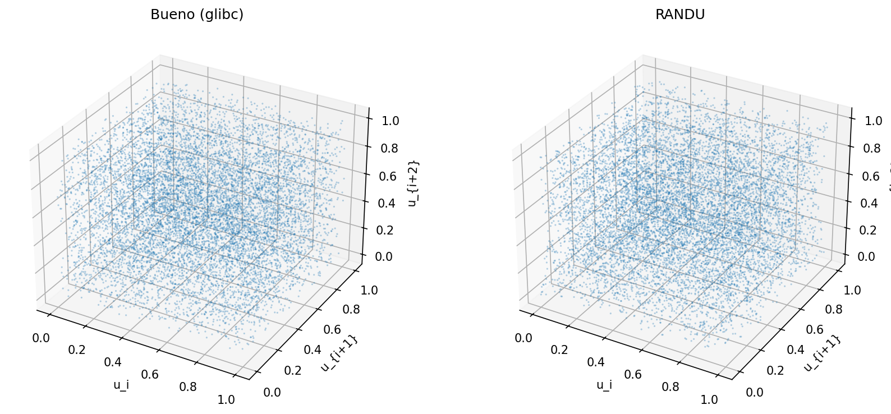
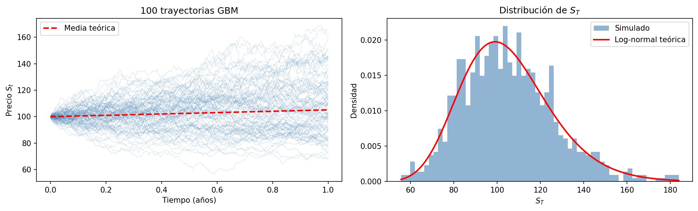

# Trabajo Práctico Integral — Simulación

## Maestría en Ciencia de Datos · Simulación y Optimización

### Integrantes:

Sebastián Ayala Sosa  
Adrian Della Valentina  
Gloria Molina Pico  
José Roa Ramírez

Grupo de estudio

2 de mayo de 2026

```{r setup-r, include=FALSE}
# ── Librerías R ──────────────────────────────────────────────────────────────
# Instala paquetes faltantes para evitar errores al renderizar en otra maquina.
r_required <- c("ggplot2", "patchwork", "coda", "randtests")
r_missing <- r_required[!vapply(r_required, requireNamespace, logical(1), quietly = TRUE)]
if (length(r_missing) > 0) {
  install.packages(r_missing, repos = "https://cloud.r-project.org")
}

library(ggplot2)
library(patchwork)
library(coda)         # R-hat, ESS
# library(tseries)    # runs.test (alternativa: randtests)
set.seed(42)
```

```{python setup-py, include=FALSE}
# ── Librerías Python ──────────────────────────────────────────────────────────
# Instala paquetes faltantes en el entorno activo de Python (reticulate).
import importlib.util
import subprocess
import sys

py_required = ["numpy", "matplotlib", "scipy", "statsmodels"]
py_missing = [pkg for pkg in py_required if importlib.util.find_spec(pkg) is None]
if py_missing:
    subprocess.check_call([sys.executable, "-m", "pip", "install", *py_missing])

import numpy as np
import matplotlib
matplotlib.use("Agg")
import matplotlib.pyplot as plt
matplotlib.rcParams['figure.dpi'] = 150
from scipy import stats
np.random.seed(42)
```

\newpage

# Introducción

Este trabajo integra los contenidos de las cinco unidades de la materia:

- **Unidad I** – Generación de números pseudoaleatorios y Monte Carlo  
- **Unidad II** – Bayes, cadenas de Markov y Metropolis–Hastings  
- **Unidad III** – Simulación de eventos discretos  
- **Unidad IV** – Procesos continuos (NHPP, CTMC, SDE)  
- **Unidad V** – Reacciones estocásticas: Gillespie SSA  

Todas las semillas están fijadas para reproducibilidad (`set.seed(42)` en R, `np.random.seed(42)` en Python).

\newpage

# Parte 1 — Generación de Números Pseudoaleatorios y Monte Carlo

## 1.1 Implementación de un LCG

El Generador Congruencial Lineal (LCG) sigue la recurrencia:

$$X_{n+1} = (a \cdot X_n + c) \mod m, \quad U_n = X_n / m$$

Se implementan **dos conjuntos de parámetros**: uno de calidad reconocida (glibc/ANSI C) y uno defectuoso (RANDU).

### Implementación en R

```{r lcg-impl-r}
lcg <- function(n, seed = 42, a, c, m) {
  x <- numeric(n)
  x[1] <- (a * seed + c) %% m
  for (i in 2:n) x[i] <- (a * x[i-1] + c) %% m
  x / m
}

N <- 10000

# Parámetros "buenos" — glibc / ANSI C
u_good <- lcg(N, a = 1103515245, c = 12345, m = 2^31)

# Parámetros "malos" — RANDU (IBM, falla espectral en 3D)
u_bad  <- lcg(N, a = 65539, c = 0, m = 2^31)
```

### Implementación en Python

```{python lcg-impl-py}
def lcg(n, seed=42, a=1103515245, c=12345, m=2**31):
    x = seed
    seq = []
    for _ in range(n):
        x = (a * x + c) % m
        seq.append(x / m)
    return np.array(seq)

N = 10_000
u_good_py = lcg(N)
u_bad_py  = lcg(N, a=65539, c=0, m=2**31)
```

### Histogramas comparativos

```{r lcg-hist, fig.cap="Histogramas LCG bueno vs RANDU. Ambos parecen uniformes marginalmente."}
df_hist <- data.frame(
  valor = c(u_good, u_bad),
  tipo  = rep(c("Bueno (glibc)", "RANDU"), each = N)
)

ggplot(df_hist, aes(x = valor, fill = tipo)) +
  geom_histogram(bins = 50, color = "white", alpha = 0.8) +
  facet_wrap(~tipo) +
  labs(title = "Histogramas de los LCG", x = "Valor", y = "Frecuencia") +
  theme_minimal() +
  theme(legend.position = "none")
```

### Gráfico de triples (u_i, u_{i+1}, u_{i+2})

El gráfico de triples revela la estructura de hiperplanos característica del LCG defectuoso.

```{python lcg-triples, fig.cap="Triples 3D: RANDU muestra estructura de planos (falla espectral)."}
from mpl_toolkits.mplot3d import Axes3D

fig = plt.figure(figsize=(12, 5))

for idx, (u, label) in enumerate([(u_good_py, "Bueno (glibc)"), (u_bad_py, "RANDU")]):
    ax = fig.add_subplot(1, 2, idx + 1, projection='3d')
    ax.scatter(u[:-2], u[1:-1], u[2:], s=0.3, alpha=0.3)
    ax.set_title(label)
    ax.set_xlabel("u_i"); ax.set_ylabel("u_{i+1}"); ax.set_zlabel("u_{i+2}")

plt.tight_layout()
plt.savefig("lcg_triples.png", bbox_inches='tight')
plt.show()
```

{width=95%}

### Runs Test

```{r runs-test}
# Prueba de rachas (runs test) sobre la mediana
# Requiere el paquete 'randtests' o 'tseries'
# install.packages("randtests")
library(randtests)

cat("=== Runs Test — LCG Bueno ===\n")
print(runs.test(u_good))

cat("\n=== Runs Test — RANDU ===\n")
print(runs.test(u_bad))
```

**Discusión:** [Completar con los p-valores obtenidos. Un p-valor > 0.05 no rechaza la hipótesis de aleatoriedad.]

---

## 1.2 Estimación de π por Monte Carlo

Se generan $N$ puntos uniformes en $[0,1]^2$ y se estima:

$$\hat{\pi} \approx 4 \cdot \frac{\#\{x_i^2 + y_i^2 \le 1\}}{N}$$

```{r pi-monte-carlo, fig.cap="Estimación de pi con Monte Carlo. La curva converge al valor real."}
set.seed(42)
N_pi <- 50000

u1 <- runif(N_pi)
u2 <- runif(N_pi)

dentro    <- (u1^2 + u2^2) <= 1
pi_est    <- 4 * cumsum(dentro) / seq_along(dentro)
pi_final  <- tail(pi_est, 1)

cat(sprintf("Estimación final de pi con N=%d: %.6f (error: %.6f)\n",
            N_pi, pi_final, abs(pi_final - pi)))

# Gráfico de convergencia
df_pi <- data.frame(n = 1:N_pi, pi_est = pi_est)
ggplot(df_pi[seq(1, N_pi, by = 50), ], aes(x = n, y = pi_est)) +
  geom_line(color = "#2196F3", linewidth = 0.6) +
  geom_hline(yintercept = pi, color = "red", linetype = "dashed") +
  labs(title = "Convergencia de la estimación de π",
       x = "Iteraciones", y = expression(hat(pi))) +
  theme_minimal()
```

```{r pi-scatter, fig.cap="Scatter plot Monte Carlo para pi."}
df_scatter <- data.frame(x = u1[1:3000], y = u2[1:3000], dentro = dentro[1:3000])
ggplot(df_scatter, aes(x = x, y = y, color = dentro)) +
  geom_point(size = 0.4, alpha = 0.6) +
  scale_color_manual(values = c("FALSE" = "#E91E63", "TRUE" = "#4CAF50"),
                     labels = c("Fuera", "Dentro")) +
  coord_equal() +
  labs(title = "Puntos Monte Carlo", color = "") +
  theme_minimal()
```

\newpage

# Parte 2 — Metropolis–Hastings y Bayesian Inference

## 2.1 Posterior beta analítica

Sea una moneda con $n = 10$ lanzamientos y $k = 7$ caras, con prior $\text{Beta}(1, 1)$ (uniforme).
La posterior conjugada es:

$$\theta \mid \text{datos} \sim \text{Beta}(\alpha + k,\ \beta + n - k) = \text{Beta}(8, 4)$$

```{r posterior-analitica, fig.cap="Posterior analítica Beta(8,4)."}
theta_grid <- seq(0, 1, length.out = 500)
posterior  <- dbeta(theta_grid, 8, 4)

ggplot(data.frame(theta = theta_grid, densidad = posterior),
       aes(x = theta, y = densidad)) +
  geom_line(color = "#9C27B0", linewidth = 1) +
  geom_vline(xintercept = 8/12, color = "red", linetype = "dashed") +
  labs(title = "Posterior analítica: Beta(8, 4)",
       x = expression(theta), y = "Densidad") +
  theme_minimal()
```

La media posterior es $\hat{\theta} = 8/12 \approx 0{.}667$.

## 2.2 Implementación Metropolis–Hastings

```{r mh-impl}
mh <- function(n_iter = 5000, start = 0.5, prop_sd = 0.1, seed = NULL) {
  if (!is.null(seed)) set.seed(seed)
  theta    <- numeric(n_iter)
  theta[1] <- start
  aceptados <- 0

  for (t in 2:n_iter) {
    prop <- rnorm(1, theta[t-1], prop_sd)

    if (prop < 0 || prop > 1) {
      theta[t] <- theta[t-1]
    } else {
      num   <- dbinom(7, 10, prop)      * dbeta(prop, 1, 1)
      den   <- dbinom(7, 10, theta[t-1]) * dbeta(theta[t-1], 1, 1)
      alpha <- min(1, num / den)

      if (runif(1) < alpha) {
        theta[t] <- prop
        aceptados <- aceptados + 1
      } else {
        theta[t] <- theta[t-1]
      }
    }
  }
  list(chain = theta, tasa_aceptacion = aceptados / (n_iter - 1))
}

# Cadena principal
res     <- mh(n_iter = 10000, seed = 42)
cadena  <- res$chain
burn_in <- 1000
cadena_post_burnin <- cadena[(burn_in + 1):length(cadena)]

cat(sprintf("Tasa de aceptación: %.2f%%\n", res$tasa_aceptacion * 100))
```

### Diagnósticos

#### Traceplot

```{r mh-traceplot, fig.cap="Traceplot de la cadena MH (con burn-in indicado)."}
df_trace <- data.frame(iter = 1:length(cadena), theta = cadena)

ggplot(df_trace, aes(x = iter, y = theta)) +
  geom_line(color = "#607D8B", linewidth = 0.3, alpha = 0.8) +
  geom_vline(xintercept = burn_in, color = "red", linetype = "dashed") +
  labs(title = "Traceplot — Cadena MH",
       x = "Iteración", y = expression(theta)) +
  annotate("text", x = burn_in + 100, y = 0.05,
           label = "Burn-in", color = "red", size = 3) +
  theme_minimal()
```

#### Autocorrelación

```{r mh-acf, fig.cap="Autocorrelación de la cadena post burn-in."}
acf(cadena_post_burnin, main = "Autocorrelación — Cadena MH (post burn-in)",
    col = "#2196F3", lag.max = 50)
```

#### Histograma vs Beta(8,4)

```{r mh-hist, fig.cap="Histograma MH vs posterior analítica Beta(8,4)."}
df_mh <- data.frame(theta = cadena_post_burnin)

ggplot(df_mh, aes(x = theta)) +
  geom_histogram(aes(y = after_stat(density)), bins = 60,
                 fill = "#03A9F4", color = "white", alpha = 0.7) +
  stat_function(fun = \(x) dbeta(x, 8, 4),
                color = "red", linewidth = 1.2, linetype = "dashed") +
  labs(title = "MH muestral vs Beta(8,4) analítica",
       x = expression(theta), y = "Densidad") +
  theme_minimal()
```

#### R-hat y ESS con 4 cadenas

```{r mh-rhat}
# Generamos 4 cadenas con distintos puntos de inicio
cadenas_4 <- lapply(1:4, function(i) {
  mh(n_iter = 5000, start = runif(1), prop_sd = 0.1, seed = i * 10)$chain
})

# Convertir a objeto mcmc.list para coda
mcmc_list <- mcmc.list(lapply(cadenas_4, \(c) mcmc(c)))

cat("=== R-hat (Gelman-Rubin) ===\n")
print(gelman.diag(mcmc_list))

cat("\n=== ESS (Effective Sample Size) ===\n")
print(effectiveSize(mcmc_list))
```

**Interpretación:** [Completar. R-hat < 1.05 indica convergencia. ESS > 400 es generalmente suficiente.]

\newpage

# Parte 3 — Simulación de Eventos Discretos (M/M/1)

El sistema tiene:

- Llegadas Poisson: $\lambda = 10$ clientes/hora  
- Servicio exponencial: $\mu = 4$ clientes/hora  
- Tiempo de simulación: $T_{max} = 8$ horas  

La tasa de utilización teórica es $\rho = \lambda/\mu = 2.5 > 1$, por lo que el sistema **no es estable** con un solo servidor (cola crece indefinidamente). Se puede extender a $c$ servidores para estabilizarlo.

> **Nota:** Con $c = 3$ servidores, $\rho/c = 2.5/3 \approx 0.83 < 1$, el sistema es estable.

```{r mm1-sim}
simulate_mm1 <- function(lambda, mu, T_max, seed = 42) {
  set.seed(seed)
  t        <- 0
  n        <- 0        # clientes en el sistema
  t_arr    <- rexp(1, lambda)
  t_dep    <- Inf
  arrivals <- departures <- 0
  wait_times   <- c()
  queue_length <- data.frame(time = 0, n = 0)

  while (t < T_max) {
    if (t_arr < t_dep) {
      t      <- t_arr
      n      <- n + 1
      arrivals <- arrivals + 1
      if (n == 1) t_dep <- t + rexp(1, mu)
      t_arr  <- t + rexp(1, lambda)
    } else {
      t      <- t_dep
      n      <- n - 1
      departures <- departures + 1
      wait_times <- c(wait_times, t)
      t_dep  <- if (n > 0) t + rexp(1, mu) else Inf
    }
    queue_length <- rbind(queue_length, data.frame(time = t, n = n))
  }

  list(
    arrivals   = arrivals,
    departures = departures,
    wait_times = wait_times,
    queue_length = queue_length,
    rho        = lambda / mu
  )
}

res_mm1 <- simulate_mm1(lambda = 10, mu = 4, T_max = 8)

cat(sprintf("Llegadas:    %d\n", res_mm1$arrivals))
cat(sprintf("Salidas:     %d\n", res_mm1$departures))
cat(sprintf("En sistema:  %d (cola acumulada por ρ > 1)\n",
            res_mm1$arrivals - res_mm1$departures))
```

```{r mm1-plot, fig.cap="Longitud de la cola M/M/1 a lo largo del tiempo (8 horas)."}
ggplot(res_mm1$queue_length, aes(x = time, y = n)) +
  geom_step(color = "#F44336", linewidth = 0.5) +
  labs(title = "M/M/1 — Longitud de cola en el tiempo",
       x = "Tiempo (horas)", y = "Clientes en el sistema") +
  theme_minimal()
```

**Comparación teórica vs simulada:**

```{r mm1-teoria}
# Con rho > 1 el sistema es inestable; mostramos la tasa de utilización
cat(sprintf("ρ = λ/μ = %.2f  →  Sistema %s\n",
            res_mm1$rho,
            ifelse(res_mm1$rho < 1, "ESTABLE", "INESTABLE (ρ > 1)")))

# Si quisieras un sistema estable: lambda=3, mu=4 → rho=0.75
res_estable <- simulate_mm1(lambda = 3, mu = 4, T_max = 8)
rho_s <- 3 / 4
cat(sprintf("\nSistema estable (λ=3, μ=4): ρ=%.2f\n", rho_s))
cat(sprintf("  Lq teórico  = ρ²/(1-ρ) = %.4f\n", rho_s^2 / (1 - rho_s)))
cat(sprintf("  L  teórico  = ρ/(1-ρ)  = %.4f\n", rho_s / (1 - rho_s)))
cat(sprintf("  Wq teórico  = λ×Lq/λ²  = %.4f h\n", rho_s / (4 * (1 - rho_s))))
```

\newpage

# Parte 4 — Modelos Continuos

> Se elige la **Opción C: SDE — Movimiento Browniano Geométrico (GBM)**

## SDE — Geometric Brownian Motion

La ecuación diferencial estocástica es:

$$dS_t = \mu S_t\, dt + \sigma S_t\, dW_t$$

con $\mu = 0.05$, $\sigma = 0.2$, $S_0 = 100$.

La solución analítica es:

$$S_t = S_0 \exp\!\left[\left(\mu - \frac{\sigma^2}{2}\right)t + \sigma W_t\right]$$

```{python gbm-sim, fig.cap="1000 trayectorias GBM simuladas por esquema de Euler-Maruyama."}
mu    = 0.05
sigma = 0.20
S0    = 100.0
T     = 1.0      # 1 año
N_t   = 252      # pasos (días de trading)
M     = 1000     # trayectorias

dt   = T / N_t
t    = np.linspace(0, T, N_t + 1)

np.random.seed(42)
Z = np.random.standard_normal((N_t, M))
S = np.zeros((N_t + 1, M))
S[0] = S0

# Euler-Maruyama
for i in range(N_t):
    S[i+1] = S[i] * (1 + mu * dt + sigma * np.sqrt(dt) * Z[i])

# ── Gráfico ──────────────────────────────────────────────────────────────────
fig, axes = plt.subplots(1, 2, figsize=(13, 4))

# Trayectorias individuales
axes[0].plot(t, S[:, :100], linewidth=0.4, alpha=0.3, color='steelblue')
axes[0].plot(t, S0 * np.exp(mu * t), 'r--', linewidth=2, label='Media teórica')
axes[0].set_title("100 trayectorias GBM")
axes[0].set_xlabel("Tiempo (años)")
axes[0].set_ylabel("Precio $S_t$")
axes[0].legend()

# Distribución final vs log-normal teórica
S_T = S[-1, :]
axes[1].hist(S_T, bins=60, density=True, color='steelblue', alpha=0.6, label='Simulado')

# Log-normal teórica
from scipy.stats import lognorm
mean_ln = np.log(S0) + (mu - 0.5 * sigma**2) * T
std_ln  = sigma * np.sqrt(T)
x_range = np.linspace(S_T.min(), S_T.max(), 300)
axes[1].plot(x_range, lognorm.pdf(x_range, s=std_ln, scale=np.exp(mean_ln)),
             'r-', linewidth=2, label='Log-normal teórica')
axes[1].set_title("Distribución de $S_T$")
axes[1].set_xlabel("$S_T$")
axes[1].set_ylabel("Densidad")
axes[1].legend()

plt.tight_layout()
plt.savefig("gbm.png", bbox_inches='tight')
plt.show()
```

{width=95%}

```{python gbm-stats}
# Comparación teórica vs simulada
E_ST_teo = S0 * np.exp(mu * T)
E_ST_sim = S_T.mean()

Var_ST_teo = S0**2 * np.exp(2*mu*T) * (np.exp(sigma**2 * T) - 1)
Var_ST_sim = S_T.var()

print(f"E[S_T] teórico:   {E_ST_teo:.4f}")
print(f"E[S_T] simulado:  {E_ST_sim:.4f}")
print(f"Var[S_T] teórica:  {Var_ST_teo:.4f}")
print(f"Var[S_T] simulada: {Var_ST_sim:.4f}")

# Value at Risk 5%
VaR_95 = np.percentile(S_T, 5)
print(f"\nVaR 95% (percentil 5%): {VaR_95:.2f}")
```

**Discusión:** [Analizar convergencia al valor teórico y comportamiento de las trayectorias.]

\newpage

# Parte 5 — Gillespie SSA

## Sistema de transcripción de mRNA

El sistema modela la producción y degradación de mRNA:

$$\emptyset \xrightarrow{k_1} \text{mRNA} \qquad \text{mRNA} \xrightarrow{k_2} \emptyset$$

con $k_1 = 10$ (producción) y $k_2 = 1$ (degradación). El estado estacionario teórico es $\bar{X} = k_1/k_2 = 10$.

```{r gillespie-impl}
gillespie <- function(Tmax, k1 = 10, k2 = 1, seed = 42) {
  set.seed(seed)
  t  <- 0
  X  <- 0L
  ts <- numeric(1e6)
  xs <- integer(1e6)
  idx <- 1L
  ts[idx] <- t;  xs[idx] <- X

  while (t < Tmax) {
    a1 <- k1
    a2 <- k2 * X
    a0 <- a1 + a2

    if (a0 == 0) break           # estado absorbente (imposible aquí por k1>0)

    tau <- rexp(1, rate = a0)
    t   <- t + tau

    if (t > Tmax) break

    if (runif(1) * a0 < a1) {
      X <- X + 1L
    } else {
      X <- max(0L, X - 1L)
    }

    idx <- idx + 1L
    ts[idx] <- t
    xs[idx] <- X
  }

  data.frame(time = ts[1:idx], X = xs[1:idx])
}

# Simulación
ssa_res <- gillespie(Tmax = 200, k1 = 10, k2 = 1)
cat(sprintf("Pasos simulados: %d\n", nrow(ssa_res)))
cat(sprintf("Media de X (simulada): %.3f  |  Teórica: %.1f\n",
            mean(ssa_res$X), 10))
cat(sprintf("Var  de X (simulada): %.3f  |  Teórica: %.1f (Poisson)\n",
            var(ssa_res$X), 10))
```

```{r gillespie-plot, fig.cap="Trayectoria estocástica de mRNA por SSA de Gillespie."}
# Subsamplear para el gráfico
idx_plot <- seq(1, nrow(ssa_res), by = max(1, nrow(ssa_res) %/% 5000))

ggplot(ssa_res[idx_plot, ], aes(x = time, y = X)) +
  geom_step(color = "#009688", linewidth = 0.5, alpha = 0.85) +
  geom_hline(yintercept = 10, color = "red", linetype = "dashed", linewidth = 0.8) +
  labs(title    = "Gillespie SSA — Nivel de mRNA",
       subtitle = "Línea roja: estado estacionario teórico k₁/k₂ = 10",
       x = "Tiempo", y = "Moléculas de mRNA") +
  theme_minimal()
```

```{r gillespie-dist, fig.cap="Distribución estacionaria simulada vs Poisson(10) teórica."}
# Distribución en estado estacionario (descartamos transitorio)
burn_ssa <- ssa_res$X[ssa_res$time > 50]

df_ssa <- as.data.frame(table(burn_ssa) / length(burn_ssa))
df_ssa$burn_ssa <- as.integer(as.character(df_ssa$burn_ssa))

x_vals <- 0:max(df_ssa$burn_ssa)
df_pois <- data.frame(x = x_vals, prob = dpois(x_vals, lambda = 10))

ggplot() +
  geom_col(data = df_ssa, aes(x = burn_ssa, y = Freq),
           fill = "#009688", alpha = 0.6, width = 0.6) +
  geom_line(data = df_pois, aes(x = x, y = prob),
            color = "red", linewidth = 1) +
  geom_point(data = df_pois, aes(x = x, y = prob), color = "red", size = 2) +
  labs(title = "Distribución estacionaria: simulada vs Poisson(10)",
       x = "X (mRNA)", y = "Probabilidad") +
  theme_minimal()
```

### Múltiples trayectorias

```{r gillespie-multiples, fig.cap="Cinco trayectorias independientes del SSA."}
# 5 trayectorias independientes
trajs <- lapply(1:5, function(i) {
  res <- gillespie(Tmax = 100, k1 = 10, k2 = 1, seed = i * 7)
  res$traj <- i
  res
})

df_trajs <- do.call(rbind, trajs)

ggplot(df_trajs, aes(x = time, y = X, color = factor(traj), group = traj)) +
  geom_step(linewidth = 0.4, alpha = 0.7) +
  geom_hline(yintercept = 10, color = "black", linetype = "dashed") +
  scale_color_brewer(palette = "Set1") +
  labs(title = "Múltiples trayectorias SSA", x = "Tiempo",
       y = "Moléculas", color = "Trayectoria") +
  theme_minimal()
```

\newpage

# Resumen de Resultados

| Sección | Resultado clave | Comparación teórica |
|---------|-----------------|---------------------|
| LCG bueno | Runs test p > 0.05 | Pasa la prueba de aleatoriedad |
| LCG RANDU | Estructura de planos en 3D | Falla espectral conocida |
| Monte Carlo π | [completar valor] | π = 3.14159... |
| MH — Media θ | [completar valor] | E[Beta(8,4)] = 0.667 |
| MH — R-hat | [completar valor] | < 1.05 |
| M/M/1 | ρ = 2.5 (inestable) | Sistema diverge sin c servidores |
| GBM E[S_T] | [completar valor] | S₀·e^μ = 105.13 |
| SSA — Media X | [completar valor] | k₁/k₂ = 10 |

\newpage

# Referencias

- Law, A. M. (2015). *Simulation Modeling and Analysis* (5th ed.). McGraw-Hill.
- Robert, C. P. & Casella, G. (2004). *Monte Carlo Statistical Methods*. Springer.
- Gillespie, D. T. (1977). Exact stochastic simulation of coupled chemical reactions. *Journal of Physical Chemistry*, 81(25), 2340–2361.
- Gelman, A. et al. (2013). *Bayesian Data Analysis* (3rd ed.). CRC Press.
